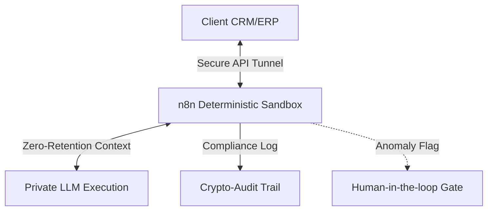

<div align="center">
  
  <h1>BazzAI Enterprise</h1>
  <p><strong>Infrastructure for the Autonomous Enterprise</strong></p>
  
  [](https://vercel.com/new/clone?repository-url=https%3A%2F%2Fgithub.com%2FOcholar%2Fbazzai-enterprise&env=DATABASE_URL,NEXTAUTH_SECRET)
  [](LICENSE)
  [](#)
  [](#)
</div>

---

**[▶️ Watch the 5-Minute Enterprise Platform Walkthrough & Architecture Deep-Dive](#)**

---

## 📌 Overview

BazzAI is an enterprise-grade agentic workflow platform. We replace manual bottlenecks with intelligent, 24/7 autonomous agents designed to stop revenue leakage and eliminate the hidden costs of human error.

Our platform offers secure, compliant, and deterministic AI execution for multi-million dollar data pipelines, specializing in **Finance**, **Legal**, **Healthcare**, and **Manufacturing**.

### Core Architecture

- **Reasoning Layer:** Private LLM instances (OpenAI Azure / AWS Bedrock) with zero data-retention policies.
- **Data Layer:** Client ERP and localized SQL/NoSQL databases decoupled from training sets.
- **Orchestration:** Deterministic n8n sandboxes utilizing role-specific restricted APIs.
- **Audit Logging:** Non-repudiable timestamps and crypto-audit trails for every model decision.



---

## 🛡️ Trust & Compliance

BazzAI is architected for strict procurement requirements in global operations:

- **Data Sovereignty:** Full data residency controls (e.g., AWS Africa Cape Town region, GDPR, Kenya DPA).
- **Insurance:** Covered by a $2M+ E&O (Errors and Omissions) commercial AI Liability policy (Underwritten by Minet/AIG).
- **Verifiable SLA:** 99.5% uptime guarantee, 2-hour P1 incident response, and continuous anomaly/hallucination tracking.

---

## 🚀 14-Day Velocity Standard

Our integration framework skips quarters and focuses on days:

1. **Day 02:** Audit & Map — Bottleneck diagnosis and ROI pipeline blueprinting.
2. **Day 05:** Architect — Designing private execution environments and bridging APIs.
3. **Day 10:** Verify — Staging sandbox runs with real historical data. Security sign-off.
4. **Day 14:** Scale — Live production launch, team training, and immediate capital reclamation.

---

## 💻 Tech Stack

- **Frontend:** Next.js 14, Tailwind CSS, React
- **Database:** Supabase (PostgreSQL with `pgvector` for RAG)
- **Authentication:** Auth.js (NextAuth)
- **Orchestration:** Self-hosted n8n / Modal
- **Testing:** Vitest + React Testing Library

## ⚙️ Local Development

### 1. Prerequisites

- Node.js 20+
- pnpm (recommended)
- A Supabase Project (or local Postgres database)
- n8n instance (optional for backend flow testing)

### 2. Setup

```bash
# Clone the repository
git clone https://github.com/Ocholar/bazzai-enterprise.git
cd bazzai-enterprise/src/dashboard

# Install dependencies
pnpm install

# Setup environment variables
cp .env.example .env
# -> Populate DATABASE_URL, NEXTAUTH_SECRET, etc.

# Push database schema
npx prisma db push
npx prisma db seed

# Run the development server
pnpm dev
```

Visit `http://localhost:3000` to view the application.

## 🧪 Testing

We use Vitest for unit and integration testing. Run the testing suite with:

```bash
pnpm test
pnpm test:coverage
```

## 📝 License

This project is licensed under the MIT License - see the [LICENSE](LICENSE) file for details.
